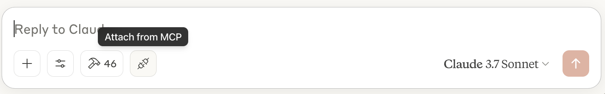

# adb-mcp

adb-mcp is a proof of concept project to create an Adobe Photoshop AI Agent by providing an interface to LLMs via the MCP protocol.

The project is not endorsed by nor supported by Adobe.

It has been tested with Claude desktop (Mac and Windows) from Anthropic, and allows Claude to control Adobe Photoshop. Theoretically, it should work with any AI App / LLM that supports the MCP protocol, and is built in a way to support other Adobe applications (such as Illustrator, InDesign and Premeire).

Example use cases include:

-   Giving Claude step by step instruction on what to do in Photoshop, providing a conversational based interface (particularly useful if you are new to Photoshop).
-   Giving Claude a task (create an instagram post that looks like a Polariod image, create a double exposure) and letting it create it from start to finish to use as a template.
-   Asking Claude to generate custom Photoshop tutorials for you, by creating an example file, then step by step instructions on how to recreate.
-   As a Photoshop utility tool (have Claude rename all of your layers into a consistent format)

Currently, the AI agent can get some information back from Photoshop which enables it to check its work. However, it cannot automatically see its work (i.e. get images from Photoshop). This should be possible, but is not yet implemented. In the meantime, you can copy and past from Photoshop into Claude desktop.

## How it works

The proof of concept works by providing:

-   A MCP Server that provides an interface to functionality within Adobe Photoshop to the AI / LLM
-   A Node based command proxy server that sits between the MCP server and Photoshop plugin
-   A Photoshop plugin that listens for commands, and drives Photoshop

**AI** <-> **MCP Server** <-> **Command Proxy Server** <-> **Photoshop UXP Plugin** <-> **Photoshop**

The proxy server is required because the UXP Based JavaScript plugin cannot listen on a socket connection (as a server) for the MCP Server to connect to (it can only connect to a socket as a client).

## Requirements

In order to run this, the following is required:

-   AI LLM with support for MCP Protocol (tested with Claude desktop on Mac & Windows)
-   Python 3, which is used to run the MCP server provided with this project
-   NodeJS, used to provide a proxy between the MCP server and Photoshop
-   Adobe UXP Developer tool (available via Creative Cloud) used to install and debug the Photoshop plugin used to connect to the proxy
-   Adobe Photoshop (26.0 or greater) with the MCP Plugin installed.


## Installation

This project has been developed and tested with Claude Desktop, and assumes that is what is being used. It should be possible to use other AI apps that support MCP.

### Download adp-mcp

Download the adp-mcp project, and unzip into the location you want to save it.

### Claude Desktop

Download and install [Claude Desktop](https://Claudee.ai/download). Once you have done this, launch to make sure everything works.

### MCP Server

Make sure you have Python3 installed and configured on your system (in your system PATH). This assumes you are using [uv](https://github.com/astral-sh/uv) for package management and have it setup and configured on your system.

Change to the psmcp directory and start the dev server:

```
$cd psmcp
$uv run mcp dev psmcp.py
```

You can now load the dev interface at http://localhost:5173, click _"connect"_, and then under _"Resources"_ click _"config://get_instructions"_. This should list out a bunch of JSON info. If it does, everything is working and configured.

Now we can install into Claude Desktop.

```
uv run mcp install --with fonttools --with python-socketio --with mcp --with requests --with websocket-client psmcp.py
```

If you have Claude desktop running, close it (make sure its not running in the background) and restart it. If it starts without any errors, you are good to go.

At this point, you still need to install a few more things.

### Command Proxy Node Sever

Make sure you have [NodeJS](https://nodejs.org/en) installed and configured in your system PATH.

Switch to _adb-proxy-socket directory_. Install the requirements, and then start the server:

```
$cd adb-proxy-socket
$npm install
$node proxy.js
```

You should see a message similar to _Photoshop MCP Command proxy server running on ws://localhost:3001_.

This proxy must be running in order for Claude to communicate with the plugin.

### Photoshop Plugin

Enable developer mode in Photoshop

1. Launch Photoshop (26.0 or greater)
2. _Settings > Plugins_ and check _"Enable Developer Mode"_
3. Restart Photoshop

From Creative Cloud Desktop, install and launch "UXP Developer Tools". When prompted, enable developer mode.

Install the plugin:

1. Select File > Add Plugin
2. Navigate to the _psuxp_ directory, and select the _manifest.json file_.
3. Once the plugin is listed, then click the "Load" button.

This should load the plugin in Photoshop. If you dont see it, you can open it via the plugins menu in Photoshop.

## Using Claude with Photoshop

Launch the following:

1. Claude Desktop
2. adb-proxy-socket node server
3. Launch Photoshop
4. Launch UXP Developer Tool and click the Load button for _Photoshop MCP Agent_
5. In Photoshop, if the MCP Agent panel is not open, open _Plugins > Photoshop MCP Agent > MCP Agent_
6. Click connect in the agent panel in Photoshop

Now you can switch over the Claude desktop. Before you start a session, you should load the instructions resource which will provide guidance and info the Claude by clicking the socket icon (Attach from MCP) and then _Choose an Intergration_ > _Adobe Photoshop_ > _config://get_instructions_.



Note, you must reload the plugin via the UCP Developer app every time you restart Photoshop.

### Setting up session

In the chat input field, click the "Attach from MCP" button (looks like two sockets). From there click "Choose and integration" and then under "Adobe Photoshop" select *config://get_instructions*. This will load the instructions into the prompt. Submit that to Claude and once it processes it, you are ready to go.


### Prompting

At anytime, you can ask the following:

```
Can you list what apis / functions are available for working with Photoshop?
```

and it will list out all of the functionality available.

When prompting, you do not need to reference the APIs, just use natural language to give instructions.

For example:

```
Create a new Photoshop file with a blue background, that is 1080 width by 720 height at 300 dpi
```

```
Create a new Photoshop file for an instagram post
```

```
Create a double exposure image in Photoshop of a woman and a forest
```

```
Generate an image of a forest, and then add a clipping mask to only show the center in a circle
```
```
Make something cool with photoshop
```


### Tips

* When prompting, ask the AI to think about and check its work.
* The more you guide it (i.e. "consider using clipping masks") the better the results
* The more advanced the model, or the more resources given to the model the better and more creative the AI is.
* As a general rule, don't make changes in Photoshop while the AI is doing work. If you do make changes, make sure to tell the AI about it.
* You can copy and paste images from Photoshop into the AI to give it more information on what is going on.
* The AI currently has issue sizing and positioning text correctly, so giving it guidelines on font sizes to use will help, as well as telling it to align the text relative to the canvas.
* The AI has access to all of the Postscript fonts on the system. If you want to specify a font, you must use its Postscript name (you may be able to ask the AI for it).
* You can ask the AI for suggestions. It comes up with really useful ideas / feedback sometimes.
* The AI will learn from its mistakes, but will lose its memory once you start a new chat. You can guide it to do things in a different way, and then ask it to start over and it should follow the new approach.

The AI currently has access to a subset of Photoshop functionality. In general, the approach has been to provide lower level tools to give the AI the basics to do more complex stuff.

By default, the AI cannot access files directly, although if you install the File System MCP server it can access, and load files into Photoshop (open files and embed images).

### Troubleshooting

* If something fails on the AI side, it will usually tell you the issue. If you click the command / code box, you can see the error.
* The first thing to check if there is an issue is to make sure the plugin in Photoshop is connected, and that the node proxy server is running.
* If response times get really slow, check if the AI servers are under load, and that you do not have too much text in the current conversation (restarting a new chat can sometimes help speed up, but you will lose the context).


## Development

Adding new functionality is relatively easy, and requires:

1. Adding the API and parameters in the *psmcp/psmcp.py* file (which is used by the AI)
2. Implementing the API in the *psuxp/commands/index.js* file.

TO BE COMPLETED

## Questions, Feature Requests, Feedback

If you have any questions, feature requests, need help, or just want to chat, join the [discord](https://discord.gg/fgxw9t37D7).

You can also log bugs and feature requests on the [issues page](https://github.com/mikechambers/adb-mcp/issues).

## License

Project released under a [MIT License](LICENSE.md).

[](LICENSE.md)


